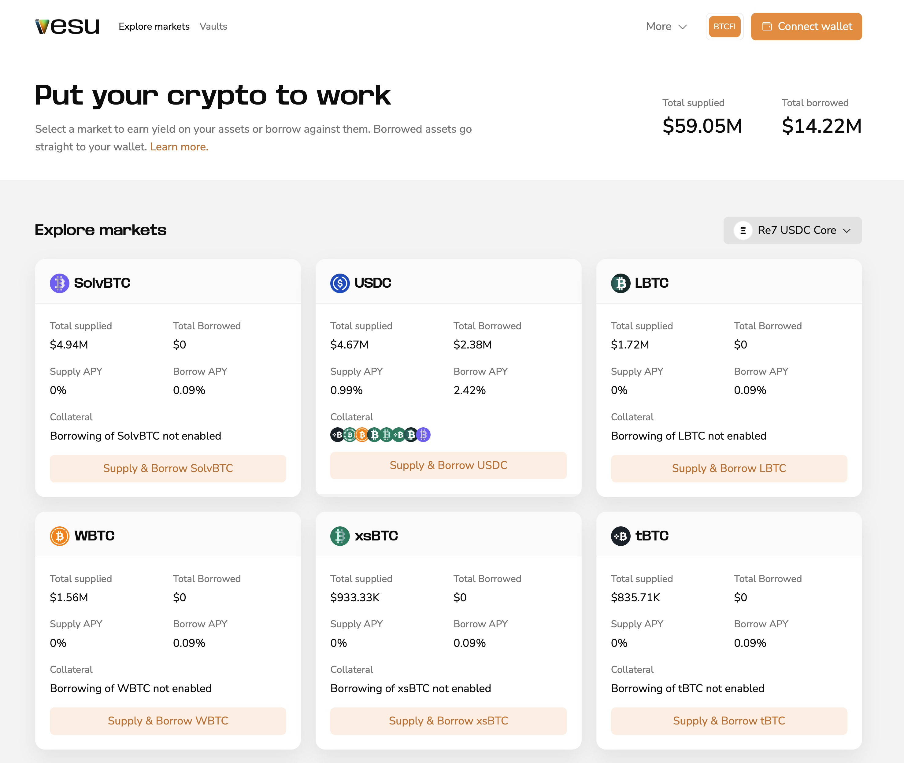
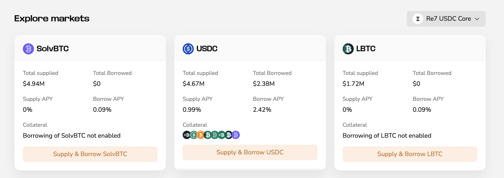
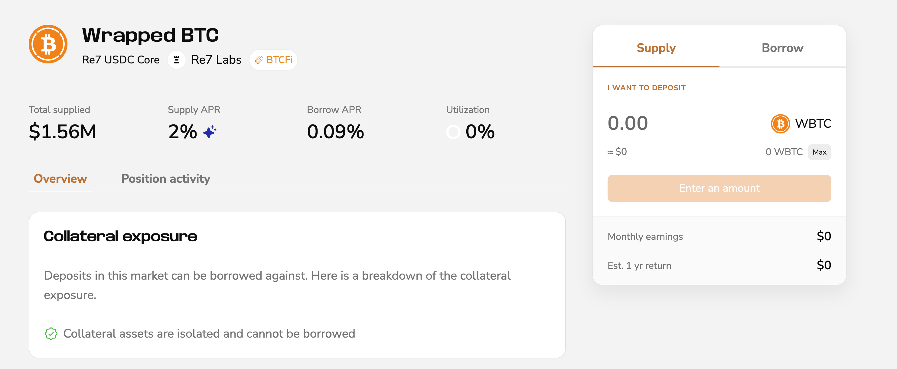

BTCFi mode is built around Bitcoin, letting you use your Bitcoin to earn and borrow.

## How BTCFi mode works

BTCFI mode shows best-fitting markets for using your Bitcoin.

Use the pool selector dropdown on the right side of the page to switch pools and explore other markets.

## Earn in BTCFi mode

1. Select a market you want to deposit
2. Set the amount and click **Start earning**
3. Confirm in your wallet

Your deposit starts earning immediately.

## Borrow in BTCFi mode

1. Select a market
2. Switch to the **Borrow** tab on the market page
3. Enter the amounts to deposit and borrow
4. Confirm in your wallet

## Vaults

Vaults behave the same in all modes.

See the [Vaults](./vaults.md) user guide for details.

## When to use PRO mode

Switch to PRO if you want:
- Multiple markets per asset
- Multiply strategies