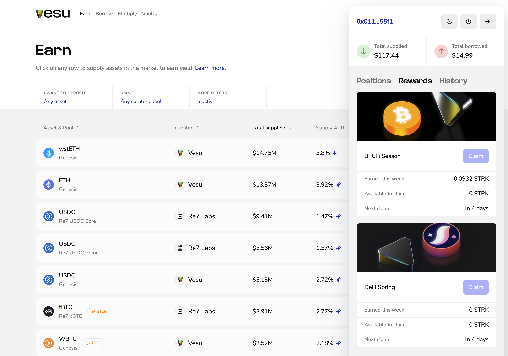

As a Vesu user, you may qualify for STRK rewards distributed by the Starknet Foundation. These rewards support active on-chain participation through programs like DeFi Spring and BTCfi Season. 

Read more about how the rewards work and which markets are eligible [here](../explore/rewards.md).

## Claim STRK rewards
	
1.	Click the button showing your connected wallet in the top-right corner.
This opens the side navigation with your open positions.

2.	Check the **Rewards** section to see if you’ve earned any.
STRK rewards are distributed weekly and become claimable every Friday (or anytime after).

3.	Click **Claim** to receive your STRK tokens.