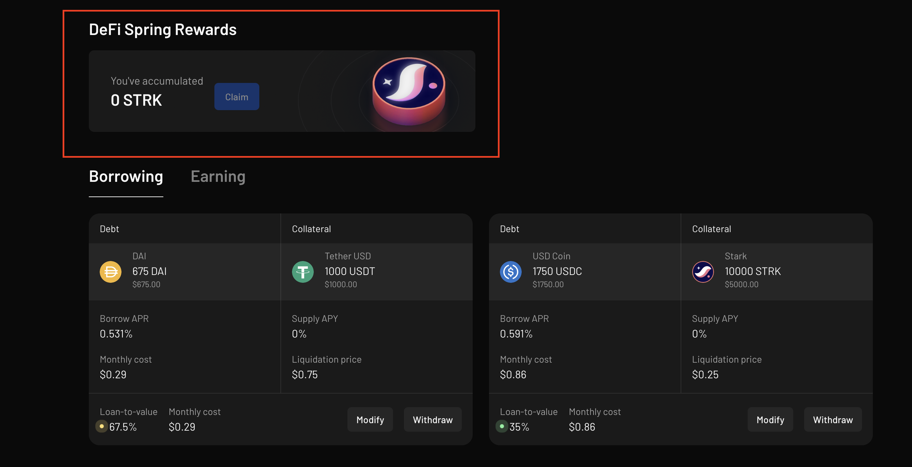

In this guide you'll be taught how to claim STRK tokens earned from the DeFi Spring rewards.

Make sure you are connected to the app before you proceed. See how [here](./connect-guide.md).

### Claim STRK rewards

To get started, ensure you already have an open position on Vesu, as that is what qualifies you for STRK rewards. Please go through the [DeFi Spring section](../explore/defi-spring.md) for more information.

To claim your STRK rewards:

1. Head over to your Vesu positions [Vesu](https://vesu.xyz/positions)

2. Just above your positions, you can see a dedicated DeFi Spring section. "Earned STRK" represents the STRKs you've accrued over time. "Claimable STRK" is the amount you can claim.

3. Hit on the "claim" button to claim accrued STRK tokens.
