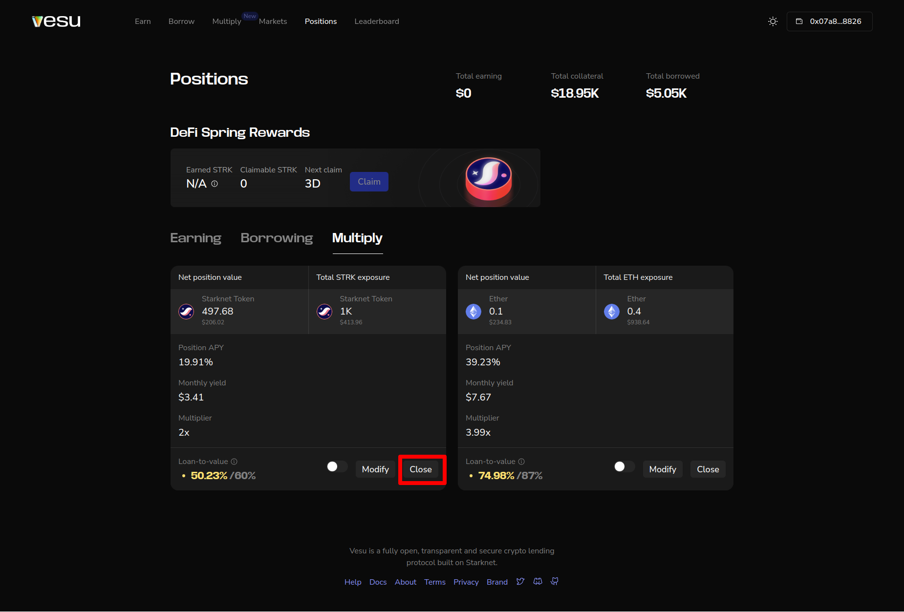
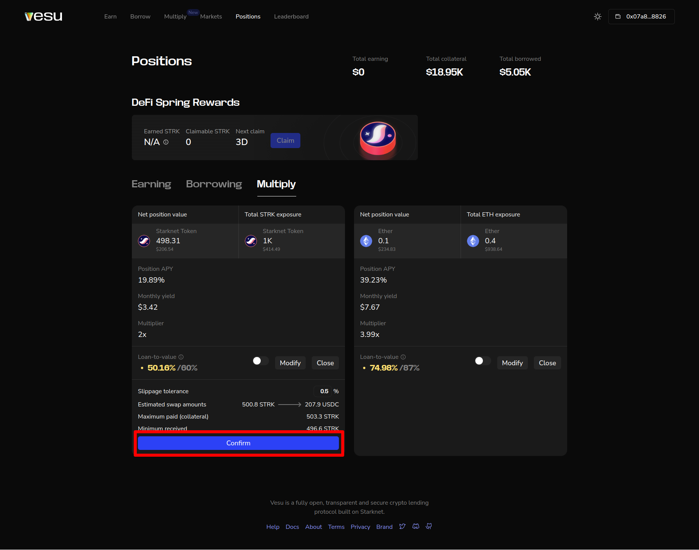

In this section, we'll learn how to close your existing multiply position.

Make sure you are connected to the app before you proceed. See how [here](./connect-guide.md).

1. To get started, ensure you already have a multiply position. You can see how to find your positions [here](./manage-positions-guide.md) or how to create a new multiply position [here](./multiply-guide.md). 

2. To close an existing multiply position, head to the position you want to close and click on the "Close" button. From the image, you can see we have two open multiply positions. Let's close the multiplied STRK position.

3. Review the swap details shown in the expanded tab on the bottom of the position card and confirm if it looks ok. Note that you can change the __slippage tolerance__ here. This can be helpful in particular in volatile markets where your close transaction reverts due to fast changing market prices.

3. Confirm your close transaction from your wallet provider, and your multiply position will be unwound instantly.