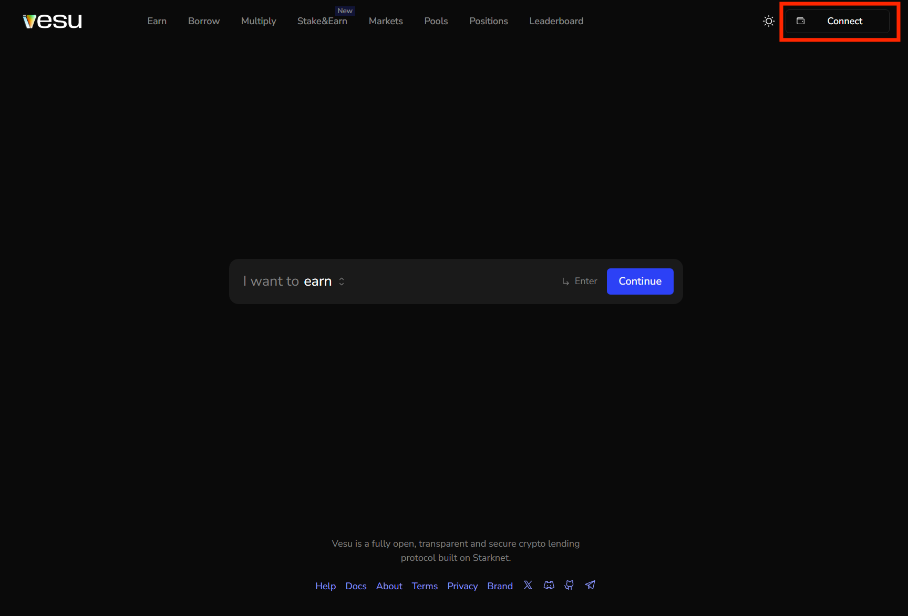
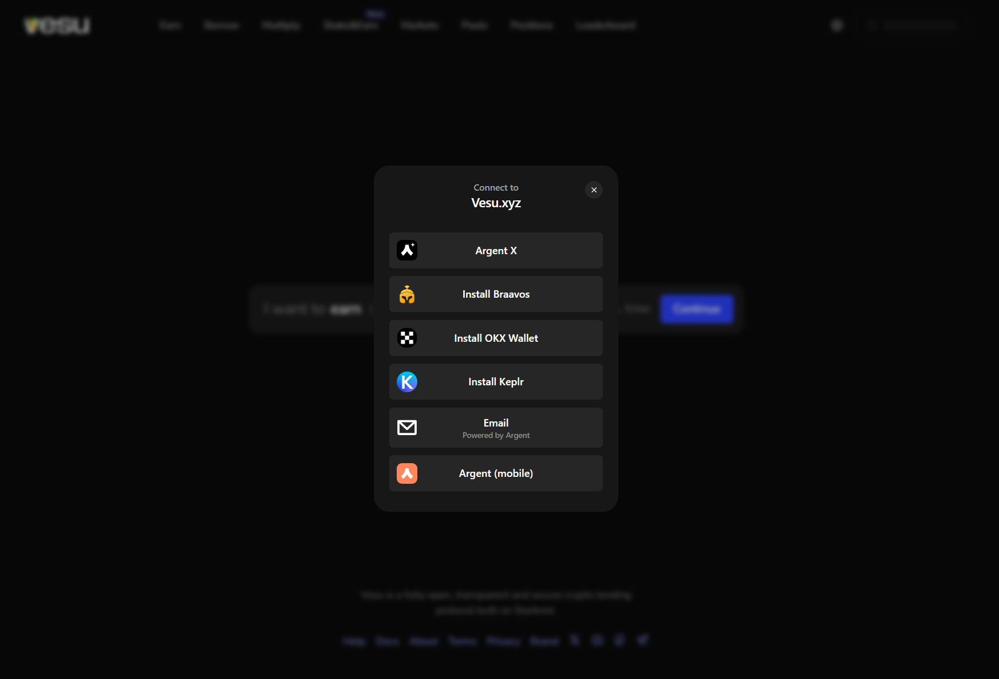
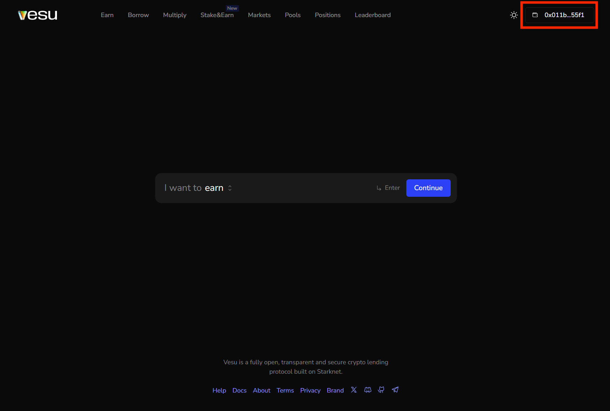

In this guide you'll be taught how to connect your starknet wallet to the app.

### Connect your wallet

1. Click on the "Connect" button on the top right hand corner. 

2. Choose one of the available wallets to connect.

3. Once you see your address on the top right hand corner, you are connected.

