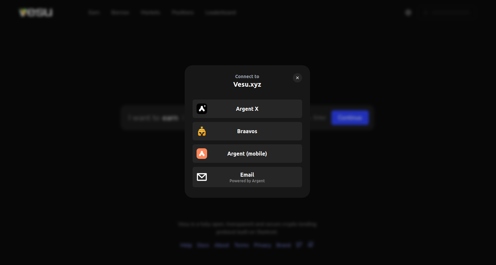

In this guide you'll be taught how to connect your starknet wallet to the app.

### Connect your wallet

1. Click on the "Connect" button on the top right hand corner. 

2. Please make sure you have installed one of these wallets on you browser then click on it.

3. Once you see your address on the top right hand corner, you are connected.

