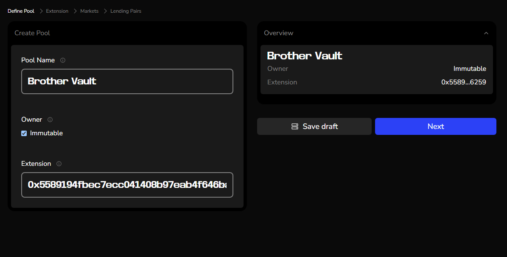
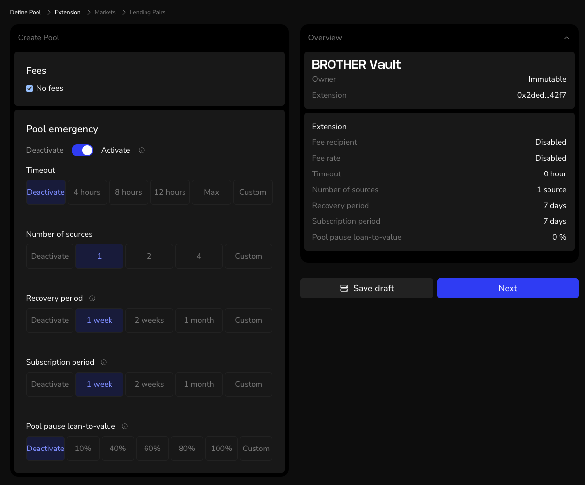
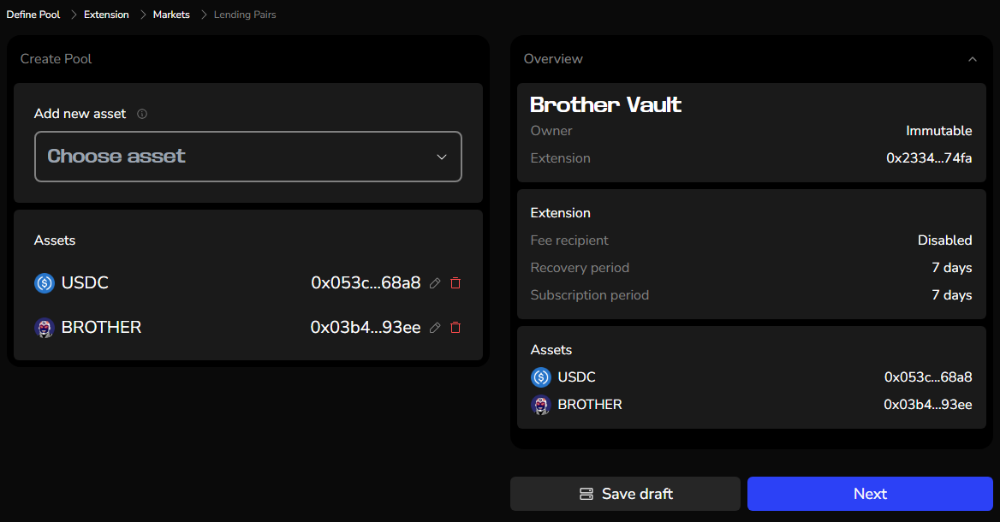
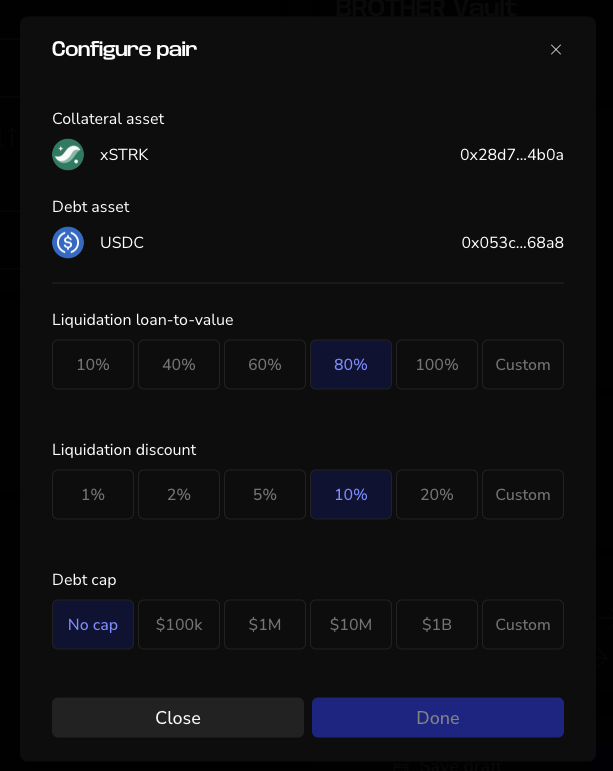
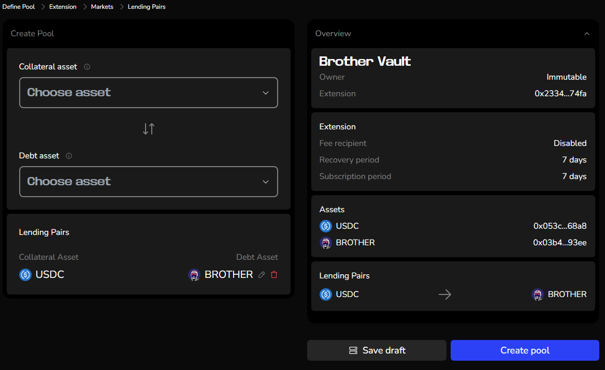

In this section, we'll learn how to create new Vesu markets.

Vesu's permissionless nature enables everyone to create new lending pools calling the respective protocol function directly (e.g. through a block explorer). An easier way to do it is with the Pools page.

## Requirements

- Starknet Wallet: A multisig setup is strongly recommended for the curator role to minimize risks.
- Small Token Amount: A small amount of the token is required to seed the pool (at least 1,000 units in the smallest denomination, such as 0.001 USDC for a USDC pool). This amount is burned to prevent share inflation attacks and ensure pool integrity.

## Step-by-step Guide

Click the blue _Create Pool_ button on the Pools [page](http://vesu.xyz/pools).

**1. First set the following parameters:**
- Name of your pool.
- Set a Starknet account as owner or choose Immutable. If Immutable is selected no changes are possible after the creation of the new pool.
- Choose the extension contract with lending hook implementations to use for the pool. For the launch there is just one extension from Pragma available. 

**2. Define the Extension**
- Fee recipient: Set a Starknet account as recipient for fees, or check the Box for “No fees”

Choose if _Pool emergency_ should be activated. If activated, specify:
- Number of sources: Set the number of data providers required for the oracle.
- Recovery period: The time during which a pool in emergency pause mode can attempt to recover. If you do not wish to enable an emergency pause mode, select "Deactivate". However, it is strongly recommended to keep this feature active for immutable pools to ensure an orderly shutdown mechanism. This helps limit losses and prevents potential bank runs.
- Subscription period: Defines the timeframe within which borrowers have to repay their outstanding debt in order to be able to withdraw their collateral for a pool in shutdown mode. This is directly tied to the emergency pause mode and can only be deactivated if the _Recovery Period_ parameter is also deactivated.
- Pool pause loan-to-value: When the total LTV for a lending pair reaches this threshold, borrowing and withdrawals are paused to protect users and ensure stability.

:::note
Learn more about the shutdown mode in our [whitepaper](/explore/whitepaper#65-pool-emergency-shutdown).
:::

**3. Choose the assets for your pool and define the parameter for each token.**

Add all the assets and their configuration that should be enabled as market or collateral (or both) in the pool.

For each asset, configure the following parameters:

- Debt Floor
- Max Utilization
- Oracle Method
- vToken Name
- Interest Rate Model Specifications

**4. Define Lending Pairs**

Add all the lending pairs, consisting of a collateral asset and debt asset, and their configuration that should be enabled in the pool.

**5. Create pool**

Check all settings and verify that everything is correct. Especially if it is an immutable pool, as then you can’t change any settings after the creation. If you click in one of the sections, you can go back to this step to make changes.

When everything is correct, click _Create Pool_ and confirm the transaction in your wallet.

:::info
Reminder: A small amount of the token is required to seed the pool (at least 1,000 units in the smallest denomination, such as 0.001 USDC for a USDC pool). This amount is burned to prevent share inflation attacks and ensure pool integrity.
:::