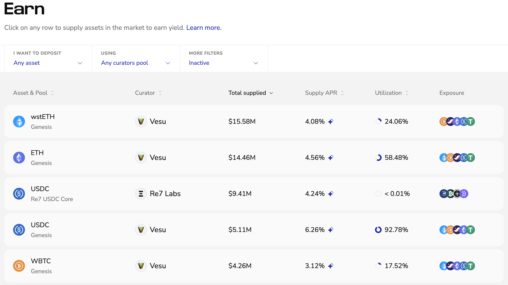
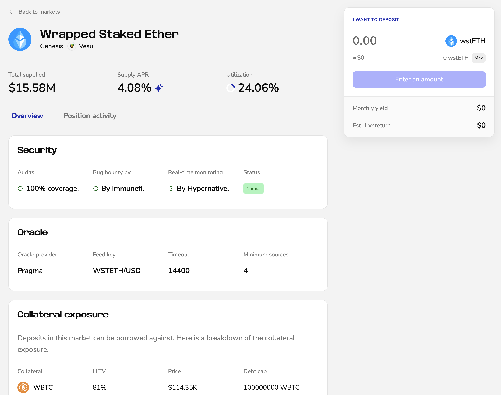
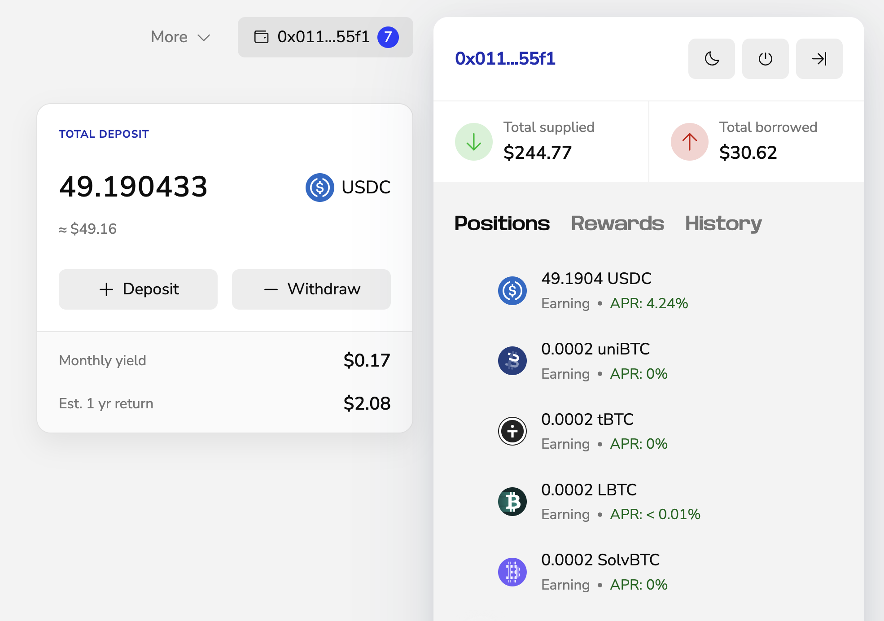

Supply assets to earn yield on Vesu. This guide explains how to open and close an Earn position using the PRO interface.

Vesu also offers a [LITE](./lite-mode.md) and a [BTCFI](./btcfi-mode.md) mode, designed for users who want a more guided earning experience with curated default markets.

### Opening a Position
Supply assets on Vesu to earn yield.

1. Go to [vesu.xyz/pro/earn](https://vesu.xyz/pro/earn) to view all available markets.  Use the filters to narrow by type, pool, curator, or other options. Click on the market you want to supply into or learn more about.

2. On the market page you’ll find details such as current supply rate, total supplied liquidity, security and oracle settings, collateral exposure, and the interest rate curve. See the [Glossary](../explore/glossary.md#positions) for definitions.

3. Enter the amount you want to supply. 
The panel shows your estimated monthly yield.  

4. Click **Start earning** and confirm the transaction in your wallet.  

Once confirmed, your position appears in the position overview and starts generating yield.

### Closing a Position
1. Click the button showing your connected wallet in the top-right corner.
This opens the side navigation with your open positions. Select the position you want to close. 

2. Click **Withdraw**, enter the amount and hit **Confirm**.

3. Sign the transaction in your wallet. Your assets will be returned to your account shortly after.
