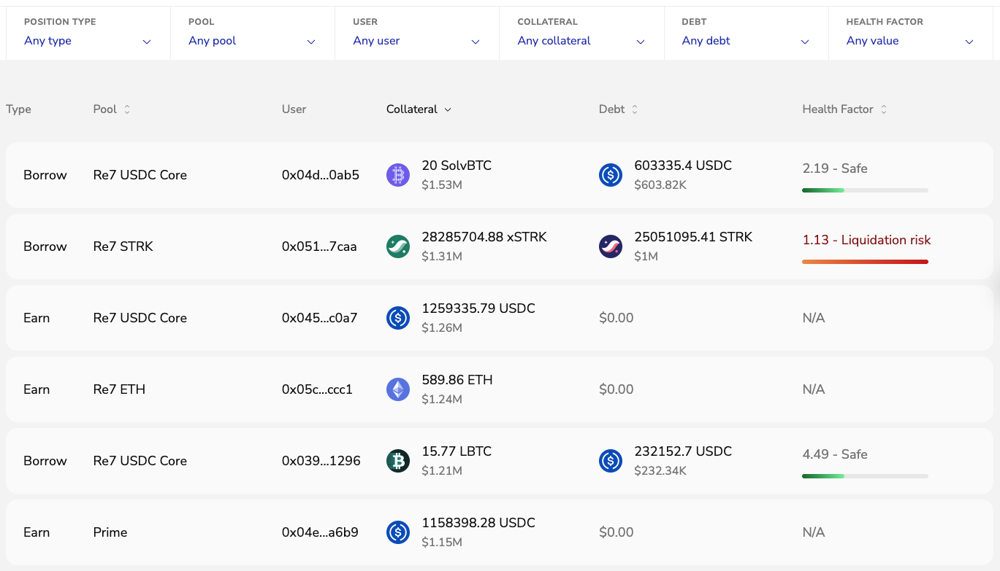
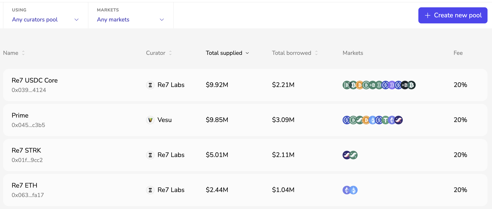
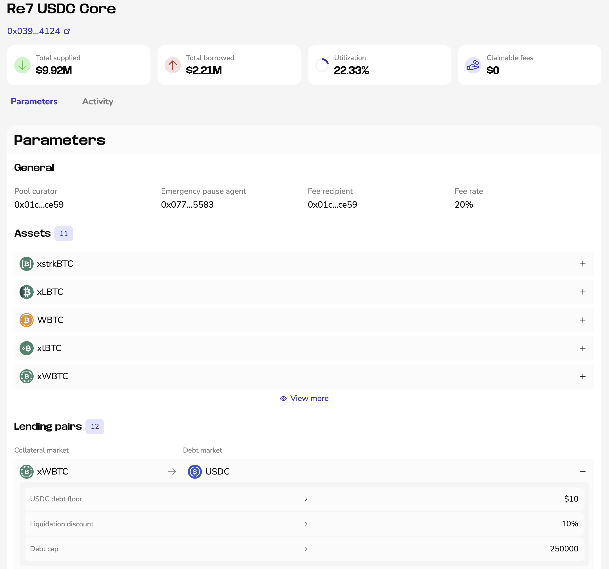
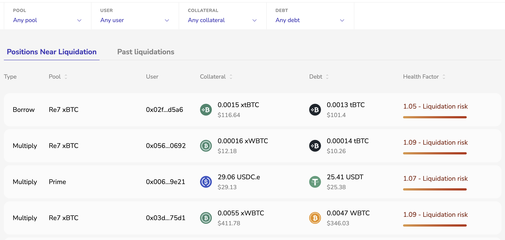

The Explore section gives an overview of activity across Vesu. It includes pages for browsing positions, exploring pools, and monitoring liquidations.

Explore is available in PRO mode only.

## Positions

View all active positions on Vesu in real time, with filters for:

- Position type
- Pool
- Wallet address
- Assets
- Health factor

## Pools

The Pools page gives an overview of all pools on Vesu.

Pools can be filtered by:

- Curator
- Markets

This makes it easy to explore pool configurations, supported markets, and risk parameters.

Clicking on a pool opens its detailed view, including:

- Pool parameters
- Supported assets
- Lending pairs
- Pool activity

Assets and lending pairs can be expanded to view additional parameters and settings.

## Liquidations

This page can be used to track positions at risk and review past liquidation events.

Liquidations can be filtered by:

- Pool
- Wallet address
- Asset

