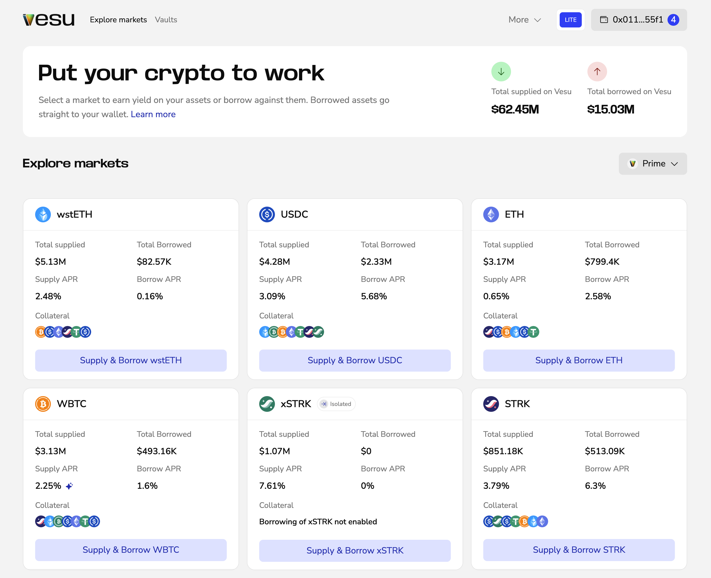
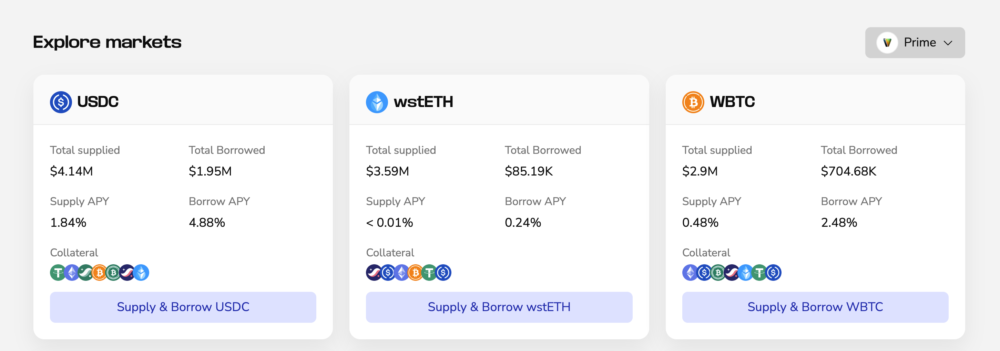
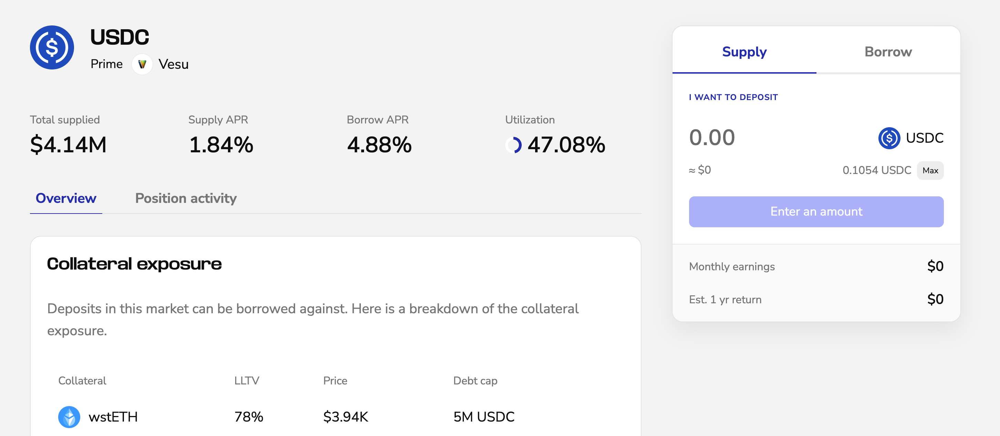

Lite mode is a simplified interface for earning and borrowing on Vesu.
It’s designed for users who want a straightforward flow without advanced configuration.

## How Lite mode works
Lite mode shows a default market per asset. This market is selected to be a good fit for most users.  
You can switch to other available markets using the pool selector.

## Earn in Lite mode

1. Select an asset you want to deposit
2. Set the amount and click **Start earning**
3. Confirm in your wallet

Your assets start earning immediately.

## Borrow in Lite mode

1. Select an asset
2. Switch to the **Borrow** tab on the market page
3. Enter amounts
4. Confirm in your wallet

Borrowed assets are sent directly to your wallet.

## Vaults

Vaults behave the same in all modes.

See the [Vaults](./vaults.md) user guide for details.

## When to use Pro mode

Switch to Pro if you want:
- Multiple markets per asset
- Multiply

