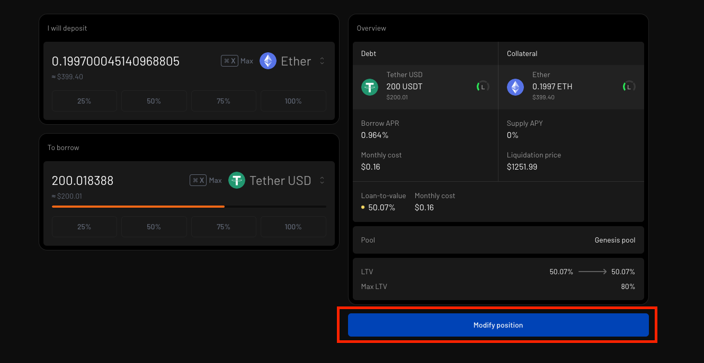

Vesu was built with simplicity in mind. Our architecture makes it easy to manage and control your positions without issues.

In this section, let's dive into what positions are and how you can effectively manage them.

### What are positions?
In the context of the financial market, a "position" simply refers to an individual or entity's ownership or exposure to a financial asset or investment.

In lending markets, we use this to refer to the assets or debts borrowed from or supplied to the market.

### How do I manage my Vesu positions?
To create a position, you need to first supply to a market or borrow from a market.

All your positions are tracked from the "Positions" tab and are grouped into:
- Borrowing: Which tracks all debts owed to the market. You can repay this debt to close the position at any point.

- Earning: This tracks all assets supplied to a market. You can withdraw all supplied assets to close the position at any point.

### Modifying positions
Modifying an already created position is easy. Simply head to that position, either a borrowing position or earning position, and click on "Modify".

Once you're done adjusting the position, simply click on the "modify position" and your position will be modified.