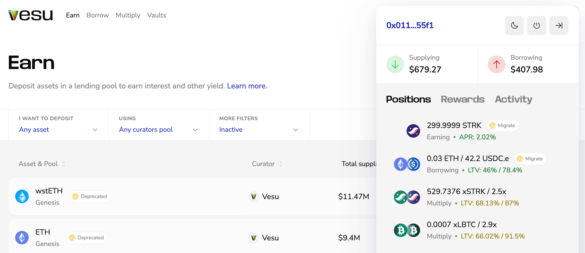
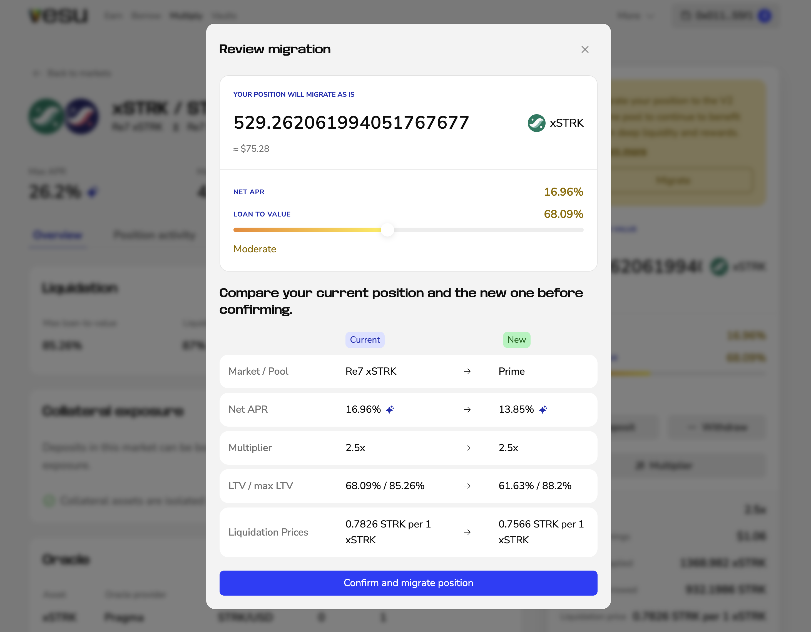
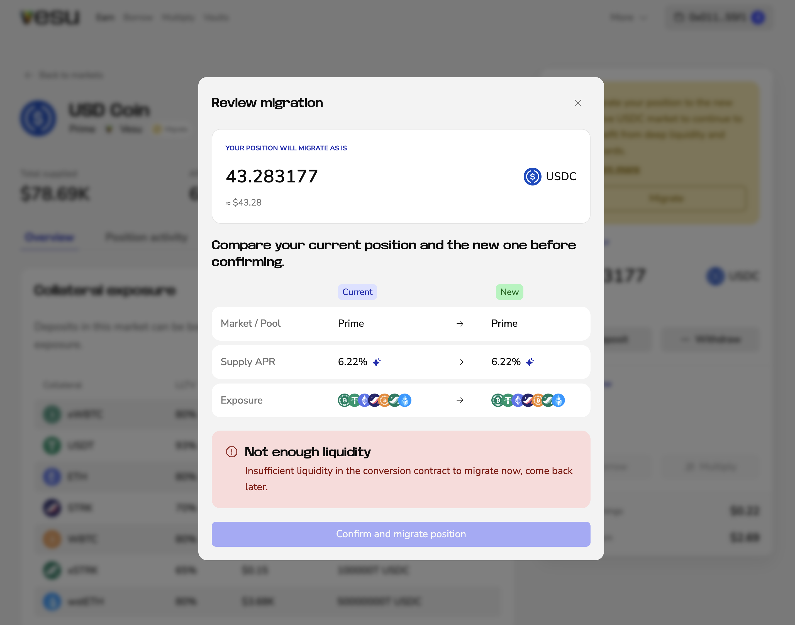

This page explains how to migrate positions that use `USDC.e` or any V1 market on Vesu.  
The migration updates your positions to native `USDC` and the improved V2 markets.  
Affected positions will automatically display a **Migrate** button.

## Summary

- `USDC.e` (legacy USDC) is being replaced by native `USDC`  
- V1 markets will enter limited mode  
  - No new deposits & borrowing  
  - No increase for Multiply positions  
  - You can still **repay**, **withdraw**, and **close** positions  
- All new liquidity and STRK rewards focus on native `USDC` and V2 markets  
- Only positions that require migration will show a **Migrate** button  

## When the Migrate button appears

You will see a **Migrate** button if:

- Your position uses `USDC.e`  
- Your position is in a V1 pool (e.g. Genesis, Braavos Vault)  

## How migration works

The migration tool makes the process simple:

1. Click the wallet button in the top-right corner to open the sidebar.  
2. Select the position showing a **Migrate** button.  
3. Click **Migrate** to open the migration dialog.  
   
   The dialog shows your current and new position side-by-side.  
   Review the values, and if everything is OK, click **Confirm and migrate position**.
4. Approve the transaction in your wallet.

Your position is recreated in the new market “as is,” using the same amounts and configuration where applicable.

## Liquidity availability

If the migration cannot complete due to low USDC liquidity, the interface displays: **Not enough liquidity**

In this case, the confirmation button remains disabled. Liquidity should return quickly, so you can try again shortly. If it seems stuck or you want to check in, feel free to ping the team on [Discord](https://discord.com/invite/G9Gxgujj8T).

## After migration

Once migration is confirmed and approved:

- Your position appears in the corresponding V2 market  
- Rewards continue on V2 pools and native `USDC`  

## Need help?
If you have questions or encounter any issues, please open a ticket in [Discord](https://discord.gg/G9Gxgujj8T).