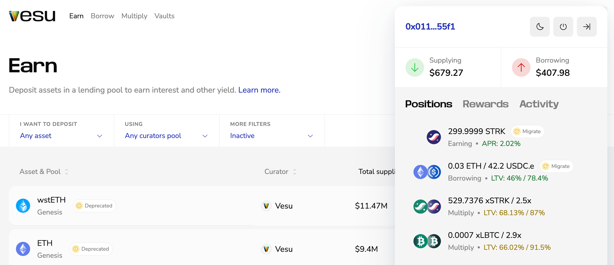
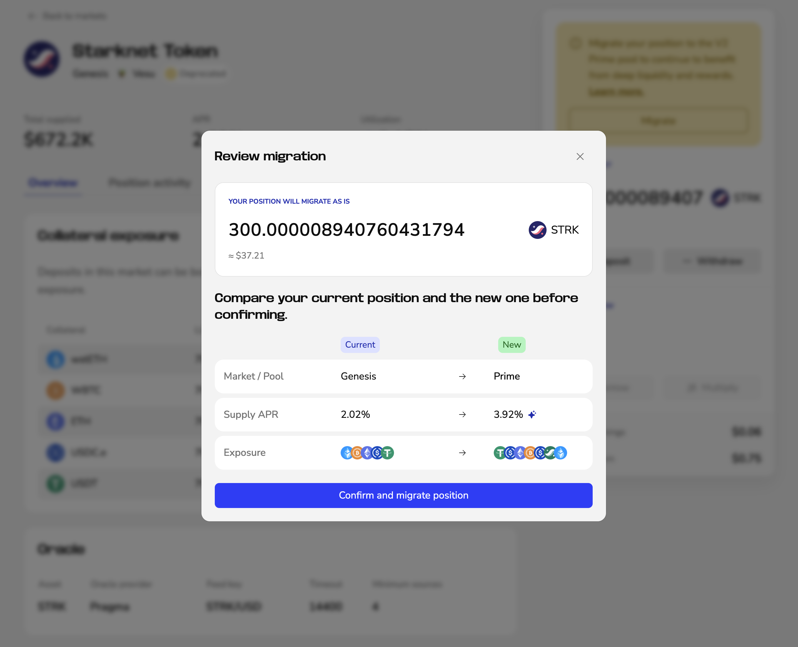
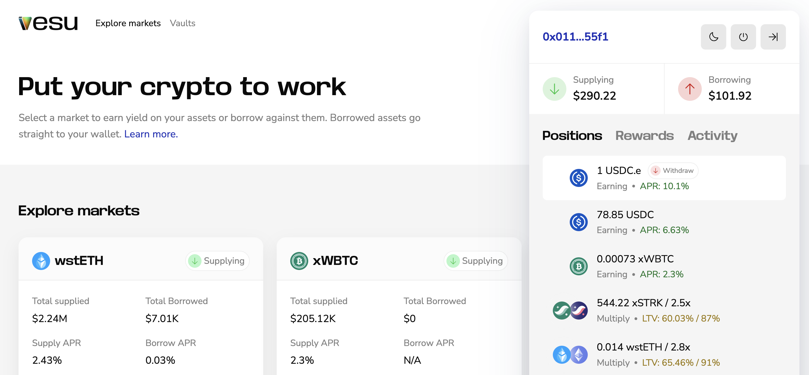

This page explains how to migrate positions that use `USDC.e` or any V1 market on Vesu.  

## Summary

- `USDC.e` (legacy USDC) is replaced by native `USDC`  
- V1 markets are deprecated  
  - No new deposits & borrowing  
  - You can still **repay**, **withdraw**, and **close** positions  

## Migrate to V2

You will see a **Migrate** button if your position is in a V1 pool (e.g. Genesis, Braavos Vault)  

The migration tool makes the process simple:

1. Click the wallet button in the top-right corner to open the sidebar. Affected positions show a **Migrate** button.  
2. Click the position to open its market page.  
3. Click **Migrate** to open the migration dialog.  
   
   The dialog shows your current and new position side-by-side. Review the values and confirm the migration. 
4. Approve the transaction in your wallet.

Your position is recreated in the new V2 market.

## Migrate to native USDC

Affected positions will show a **Withdraw** button.

1. Withdraw your `USDC.e`  

2. Convert `USDC.e` to native `USDC`  
Swap `USDC.e` to `USDC` on [Ekubo](https://ekubo.org/starknet/swap) or [Avnu](https://app.avnu.fi) when liquidity is available. Otherwise, bridge `USDC.e` via the official [Starkgate bridge](https://starkgate.starknet.io) and convert it on another chain.

3. Deposit the native `USDC` into a V2 market to continue earning yield.

## Need help?
If you have questions or encounter any issues, please open a ticket in [Discord](https://discord.gg/G9Gxgujj8T).