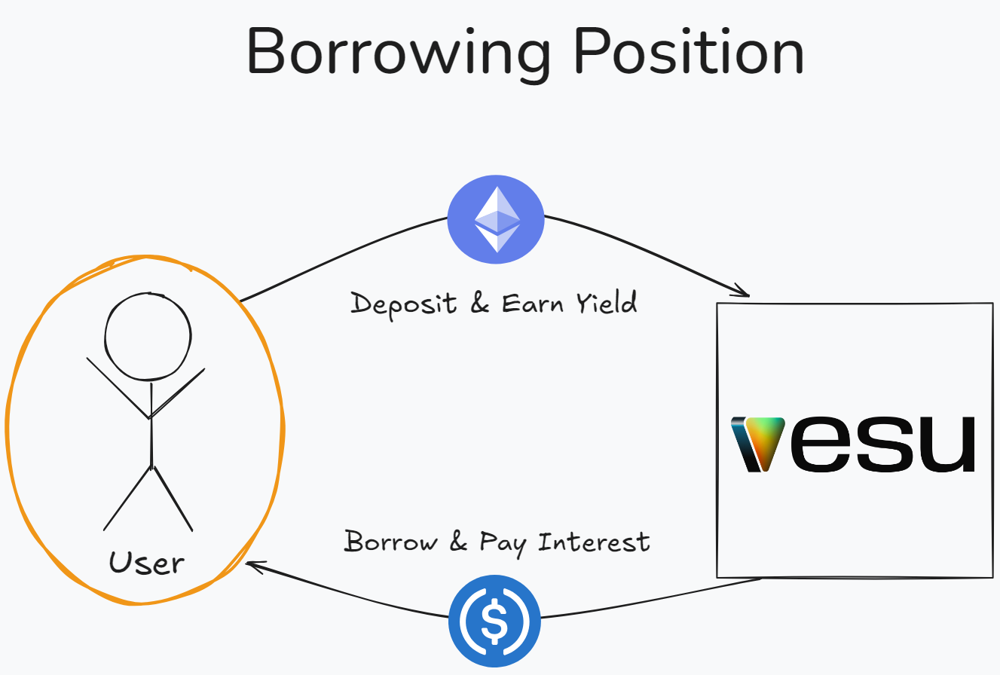
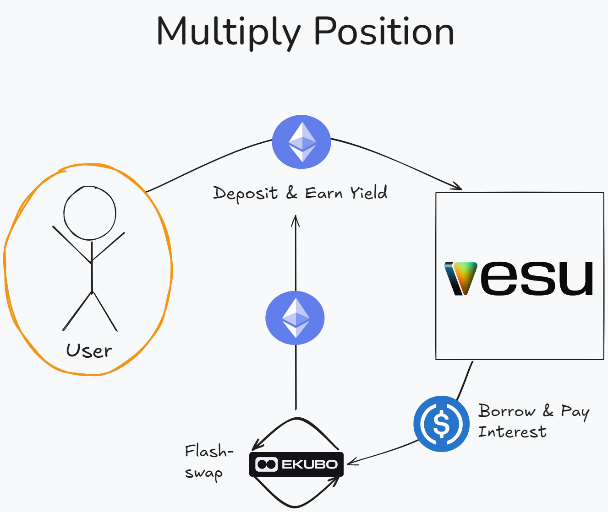

The **Multiply** feature helps users increase their exposure to an asset (i.e. ETH) and its yield with a single transaction. It’s fast and efficient, designed for users who want to boost their position without going through multiple manual steps.

## Difference Between Borrowing and Multiply

Let’s first explore how Borrowing and Multiply work, and what sets them apart.

**Borrowing**

Users receive a token they can use however they like. Whether that’s holding it, using it in other DeFi products, or deposit again to Vesu.

**Closing the Position:** When you close, you’ll need to repay the borrowed USDC, and once the debt is repaid, your collateral (ETH) will be returned to your wallet.

**Multiply**

This feature helps you increase exposure to the token you deposit. It’s similar to manual looping, but automated.

Here’s how it works with an example using ETH and USDC:

1. You deposit ETH into Vesu.
2. Vesu borrows USDC and swaps it for more ETH, giving you increased exposure to ETH and ETH yield.

There’s no need to repeat any steps. The whole process happens automatically in a single action.

**Closing the Position:** When you close, Vesu will use some of your ETH to repay the USDC debt, and any remaining ETH will be returned to your wallet.

## Multiply Position Example: Understanding the UI

Let’s explore the UI with an example to understand how Multiply works and what you need to keep in mind.

In this example, you're increasing your exposure to ETH by borrowing USDC. This doubles your exposure (2x) to ETH and increases your position's APY from 9% to 18.12%, reflecting the higher potential returns but also the increased risk. Your loan-to-value (LTV) rises to 50%, and the liquidation price is set at $1,690, meaning that if ETH's price falls to this level, your position could be liquidated. 

If you click on "More details," you'll see a breakdown of your Multiply position. 

## Essential Factors to Keep in Mind for Multiply Positions

When using the Multiply feature, here are some key factors to consider:

### **Borrow APR vs. Supply APY**

- **Supply APY** is what you earn on assets you supply.
- **Borrow APR** is the interest you pay on borrowed assets.

The Supply APY should be higher than the Borrow APR to ensure that the yield from the supplied asset offsets the interest on borrowed funds.

### **Loan-to-Value (LTV) & Liquidation Risk**

- A lower LTV reduces the chance of liquidation but also decreases the multiplying effect. Keep an eye on the liquidation price, especially when borrowing volatile assets.

### **Position & Market Monitoring**

Monitor both the price of the borrowed asset and the collateral. 

- Volatile assets like **ETH, STRK, or wBTC** can rise or fall quickly, potentially triggering liquidation or increasing profits.
- **Stablecoins (USDC, USDC)** as collateral are less risky because they hold their value, but they won't appreciate in value, limiting your upside.