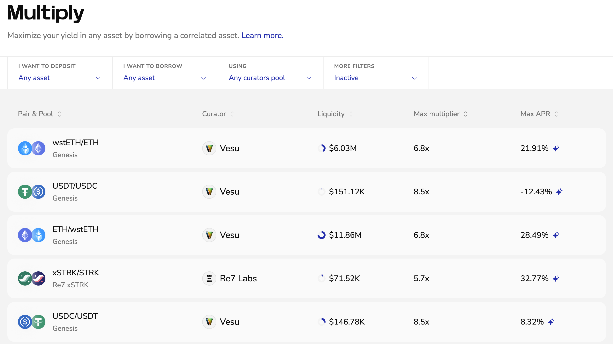
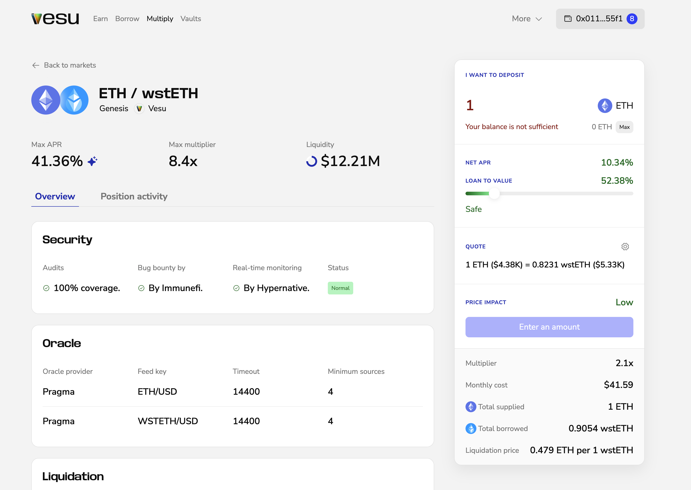

This guide walks you through opening and closing a Multiply position.

## Opening a Position
Use Multiply to increase your exposure and yield for a specific asset.

1. Go to [vesu.xyz/multiply](https://vesu.xyz/multiply) and pick a market. 
Use the filters to choose your collateral/borrow pair. You can also show only tokens in your wallet, or filter by curator and pool.  

2. On the market page, check the key info for that pair: Net APR, max multiplier, liquidity, liquidation price, and loan-to-value.  

3. Enter the amount you want to **deposit** and choose your **Loan to value**. 
The borrow amount is calculated automatically. Make sure you’re comfortable with the shown monthly yield/cost, liquidation price, and multiplier.  

4. Click **Start multiplying** and confirm in your wallet.  
Once confirmed, your position appears in your overview and starts accruing according to the displayed net APR.

## Closing a Position
To close a Multiply position:

1. Click the button showing your connected wallet in the top-right corner.
This opens the side navigation with your open positions. Select the position you want to close. 

2. Click **Close** and approve the transaction in your wallet.

3. Once confirmed, the position unwinds and your collateral returns to your wallet.  
