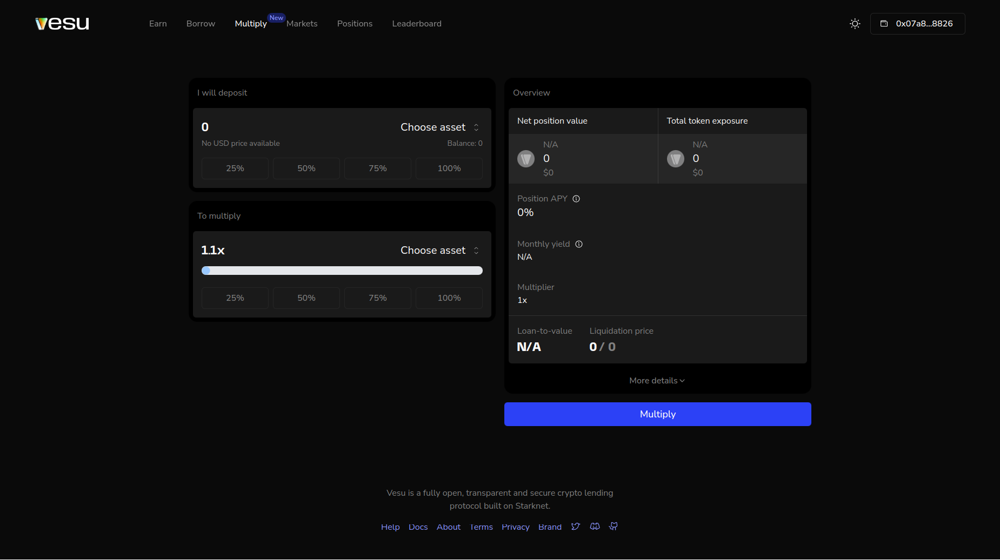
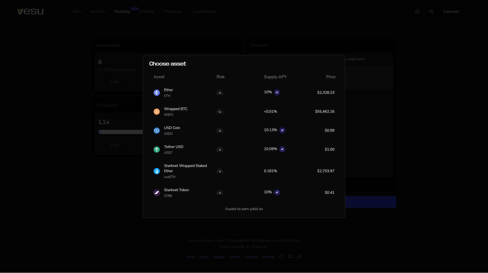
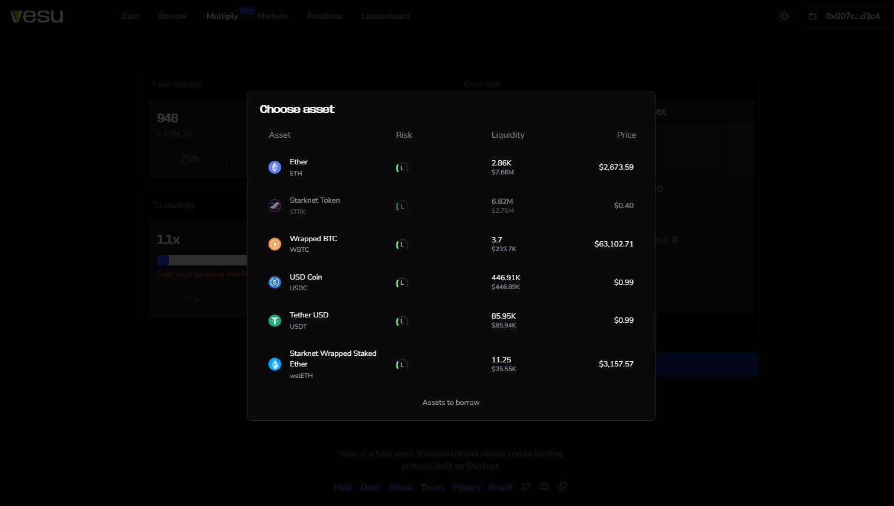
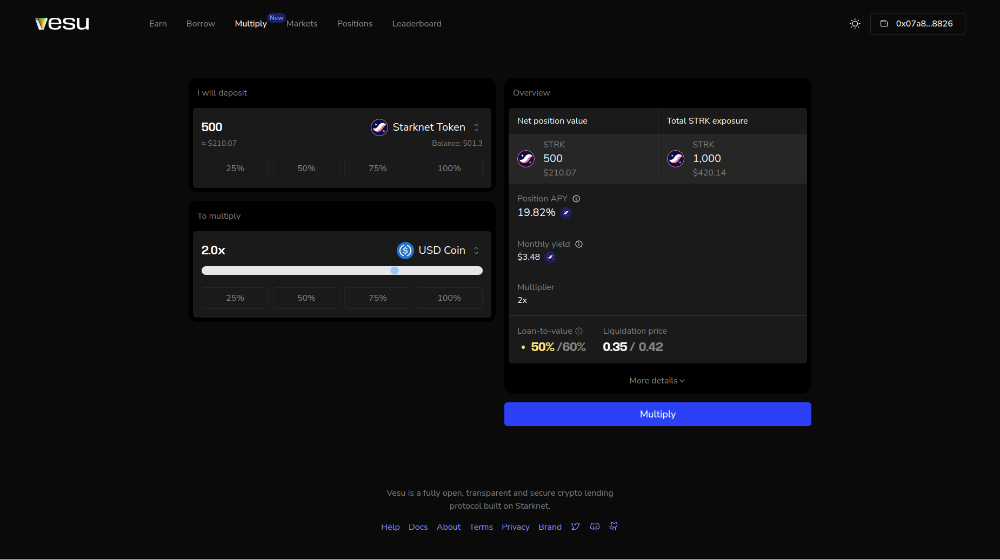
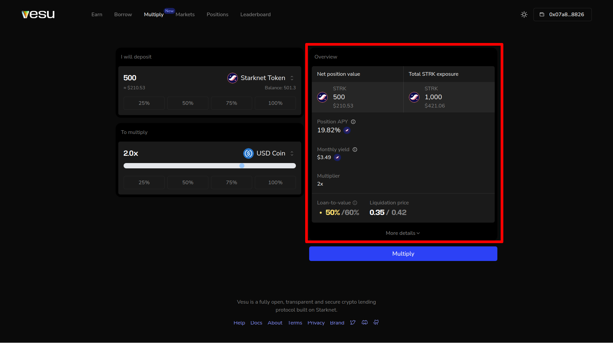
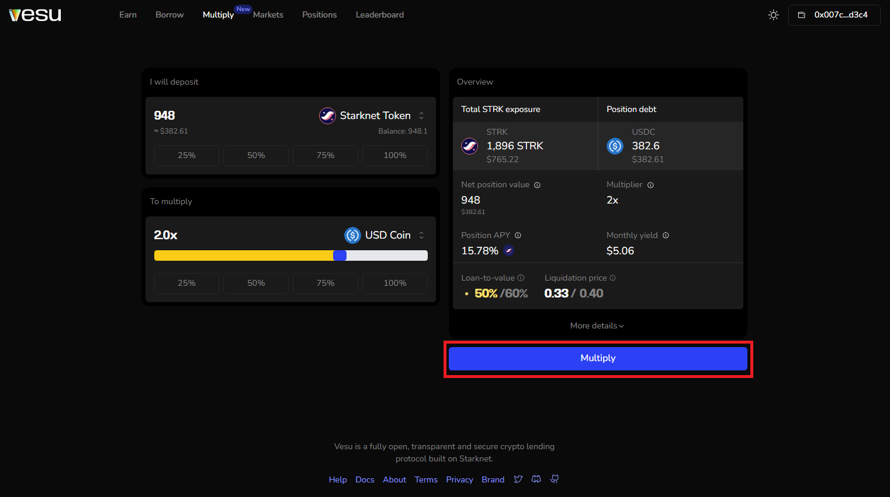
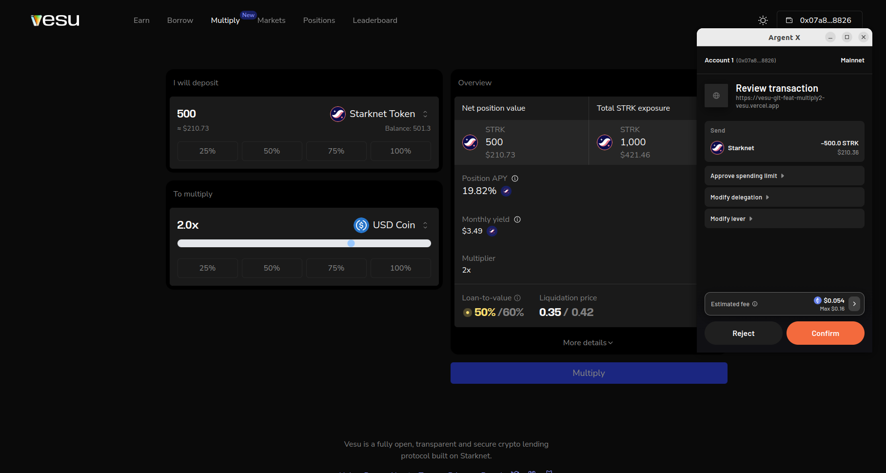

Multiply gives you the ability to enter an outsized position in your favorite Vesu market without having to own the deposited assets upfront.

In this guide, we will explain how you can create a multiply feature on a Vesu market.

Make sure you are connected to the app before you proceed. See how [here](./connect-guide.md).

1. Head over to [Vesu](https://vesu.com) and select the "Multiply" tab in the top menu.

__Alternatively__, you can also use the wizzard on the homepage and follow the "I want to multiply" flow.

2. Select the asset you are looking to create your position in. Note that you will have to seed the multiply position with a _net position value_.

3. Insert the amount of the selected asset, you'll like to seed the multiply position with.

4. Select an asset that you'll use to borrow and multiply your position with.

5. Use the slider to chose the multiplier for your position. Ensure it results in a debt amount that exceeds the borrow asset's minimum debt.

6. In the position overview on the right, you will find the position details including the _Net position value_, _Total exposure_, _Position APY_ (this is the net APY and includes the borrow cost already), and position risk metrics. Click on "More details" to see find more details including __swap details__. Make sure you understand the quoted swap details. You can also change the __slippage tolerance__ if you prefer other values.

7. Confirm the position details and swap parameters by clicking on "Multiply".

8. Confirm your transaction using your wallet provider, to create your position.

