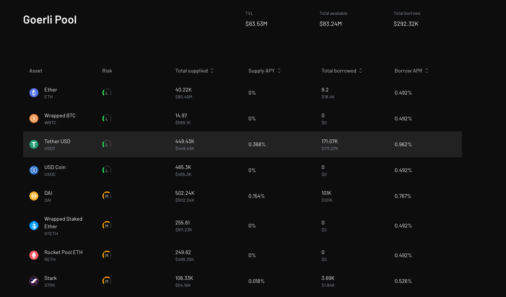
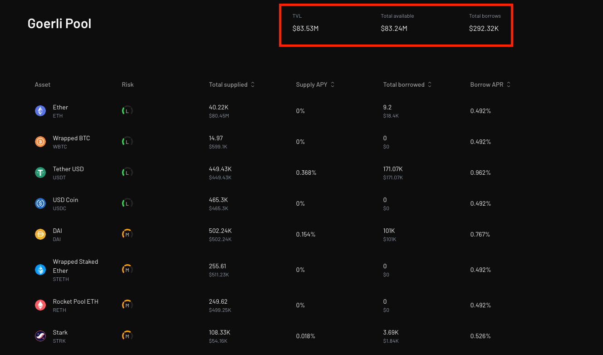

Lending markets, are compartmentalized lending facilities where risks are shared among depositors of a certain asset in a pool, but are strictly isolated across one another.

In this section, you'll learn how to navigate Vesu markets.

Make sure you are connected to the app before you proceed. See how [here](./connect-guide.md).

### Pools

Market in Vesu, is a synonym for Pool. Meaning what we refer to as markets, are simply lending pools.

Let's examine a test market and explore/breakdown all existing parts of the market.

1. The Market name.

This is simply the name of the pool. In our example here, our market is called "Goerli Pool".

2. TVL, Total available, Total borrows.

This section of the pool's UI displays crucial information as regards the pool, such as the Total Volume Locked (TVL), the value of the Total Available assets and Total borrows.

3. Available Assets

From here, you can find all the available assets in the pool, it's risk, total value supplied, Supply APY, Total borrowed and Borrow APR.

