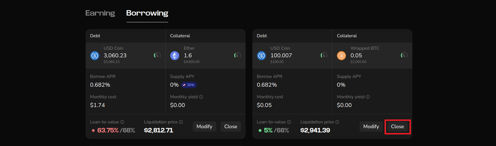

In this section, let's explore how to repay your existing debts.

1. To get started, ensure you already have a borrowing position. You can see how to do that [here](./borrow-guide.md).

2. To repay, head to the position whose debt you'll like to repay and click on the "Close" button. From the image, you can see we have two open positions. Let's repay the USDC/WBTC debt.
   

3. Confirm your withdrawal transaction from your wallet provider, and your debts will be repaid.
