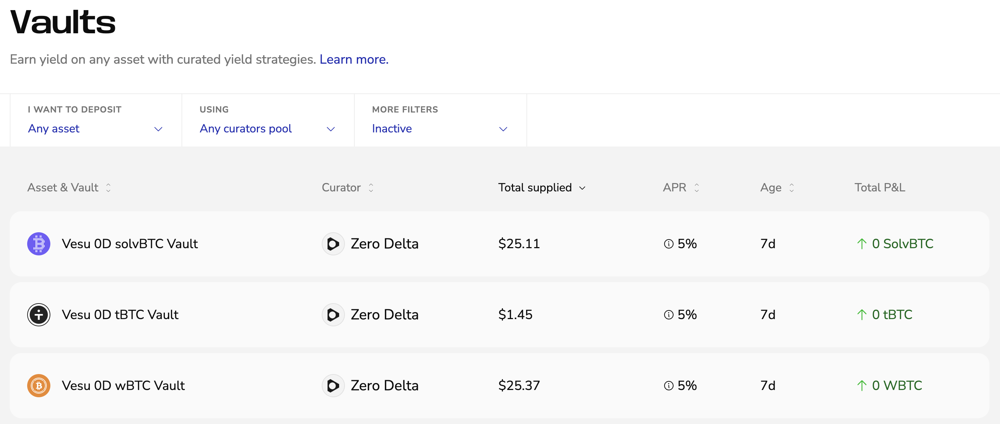
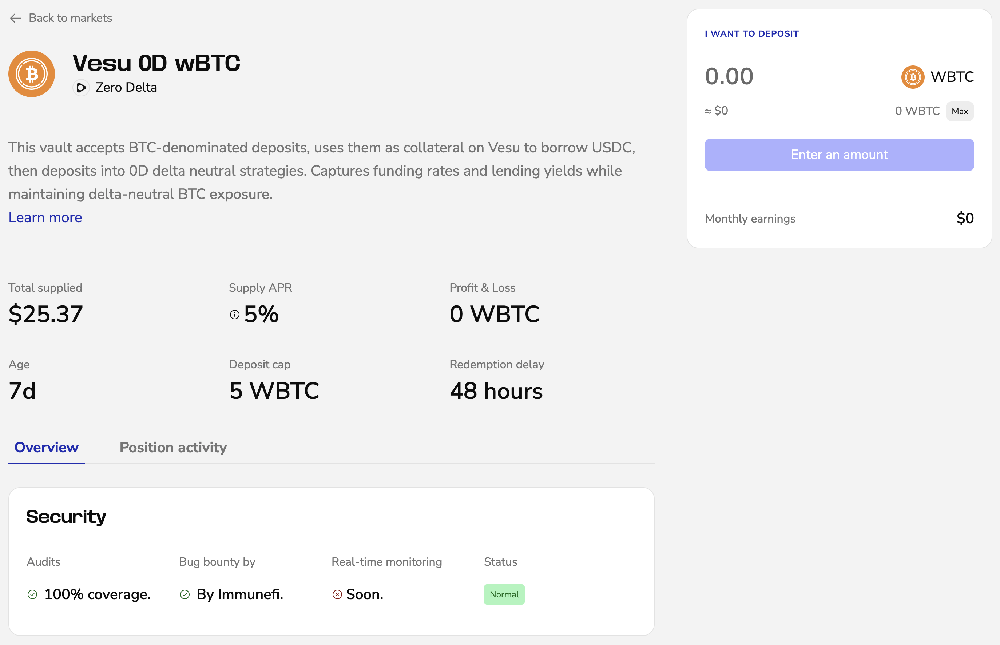

This guide walks you through using Vesu Vaults. From finding the right vault to depositing, tracking performance, and withdrawing your funds.  

Vaults let you supply assets into curated strategies, managed by curators, with automated yield generation and clear risk parameters.

## Opening a Vault Position

1. Go to [vesu.xyz/lite/vaults](https://vesu.xyz/lite/vaults) to view all available vaults.  
Use the filters to narrow by asset, curator, or status. Select the vault you want to explore or deposit into.  

2. Review the vault details.  
Each vault page shows:
- Total supplied assets and APY  
- Age of the vault and number of depositors 
- Deposit cap 
- Fees and redemption delay  
- Security coverage (audits, bug bounty, monitoring)  
- Curator and contract addresses  

3. Enter the amount you want to deposit. The panel shows your expected monthly yield.

4. Click **Deposit** and confirm the transaction in your wallet.  

Once confirmed, your position appears in the vault’s positions view and starts earning yield.  

## Managing Your Vault Position

After depositing, you can:
- View your current deposit, PnL, and yield  
- Add more funds by clicking **Deposit** again  
- Start a redemption process

## Withdrawing from a Vault

1. Click the button showing your connected wallet in the top-right corner.
This opens the side navigation with your open positions. Select the position you want to close. 
2. Enter the amount and hit **Redeem**.
2. If the vault has a redemption delay, your funds will be claimable after the delay period ends.  
3. Once ready, click **Claim** to receive the assets back in your wallet.  

