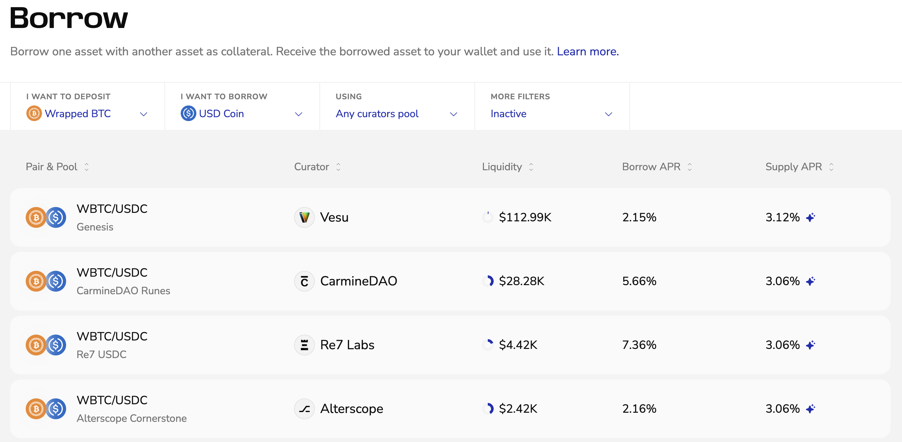

Borrow one token using another as collateral. Here’s how to open and close a borrow position on Vesu.

## Opening a Position

1. Open [vesu.xyz/borrow](https://vesu.xyz/borrow) to see available markets. Select your collateral and borrow asset. 
You can also filter by curator, pool, or show only tokens in your wallet. Click on a market to view details or start borrowing.

2. Review the market details.
You’ll see current rates, available liquidity, audit coverage, oracle settings, liquidation thresholds, and how utilization affects rates.  

3. Enter the amounts for your collateral and borrow. 
Review the expected yield, costs, and liquidation price. Choose a loan-to-value you’re comfortable with. 
See the [Glossary](../explore/glossary.md#positions) for definitions and formulas.

4. Click **Borrow** and confirm in your wallet. 
Once confirmed, your position appears in your overview with the borrowed amount and collateral balance.

## Closing a Position
To close a borrow position, you first need to have the borrowed asset in your wallet to repay the debt.

1. Go to your positions overview and select the one you want to close.  
2. Click **Close** and confirm in your wallet to repay your debt.  
3. Once confirmed, your collateral is released back to your wallet.

