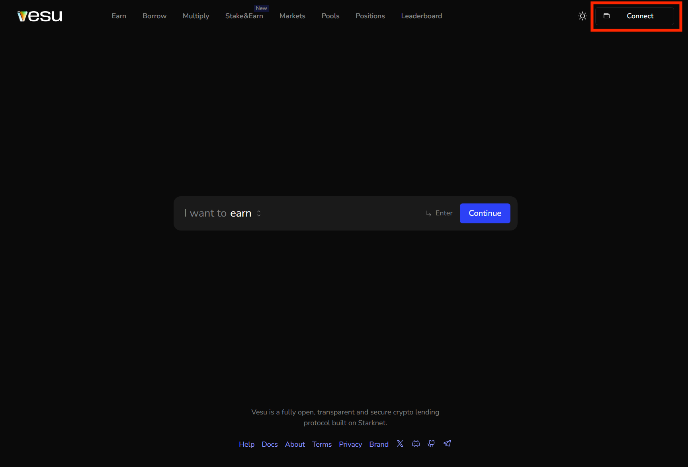
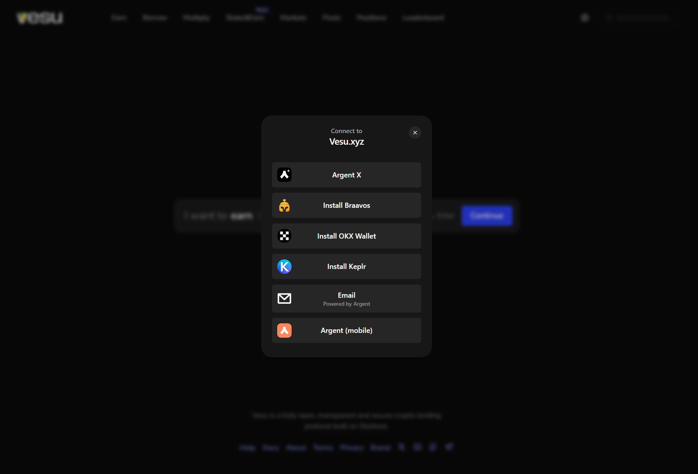
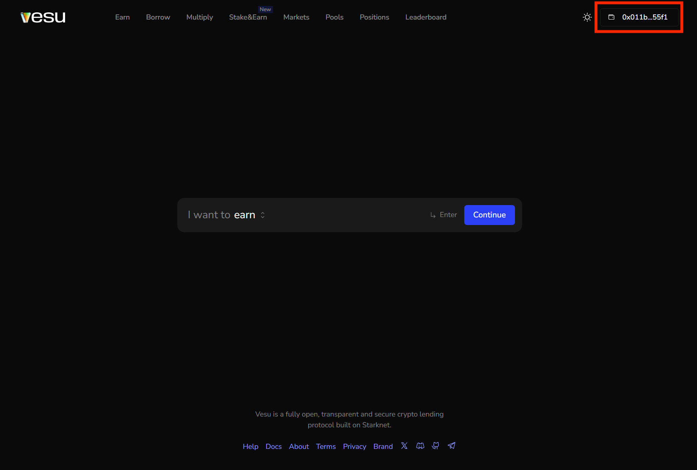

This guide shows how to set up your wallet, bridge funds, and connect to Vesu for the first time.

### Starknet wallets 

If you don’t have one yet, choose from the options [here](https://www.starknet.io/wallets/). 

### Move funds to Starknet 

Use one of the following options to move funds to Starknet:
- [StarkGate](https://starkgate.starknet.io/) – the official bridge for ETH, BTC, and more from Ethereum
- [Layerswap](https://layerswap.io/app?destNetwork=starknet_mainnet) – bridge from multiple chains and directly from centralized exchanges like Binance, Coinbase, Kraken, etc.

Some exchanges like Binance also support direct withdrawals to Starknet.

### Connect your wallet

1. Click on the "Connect" button on the top right hand corner. 

2. Choose one of the available options to connect. 

3. Once you see your address on the top right hand corner, you are connected.

