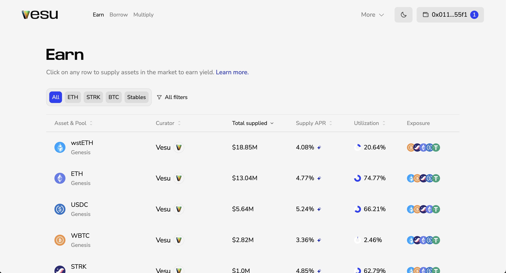
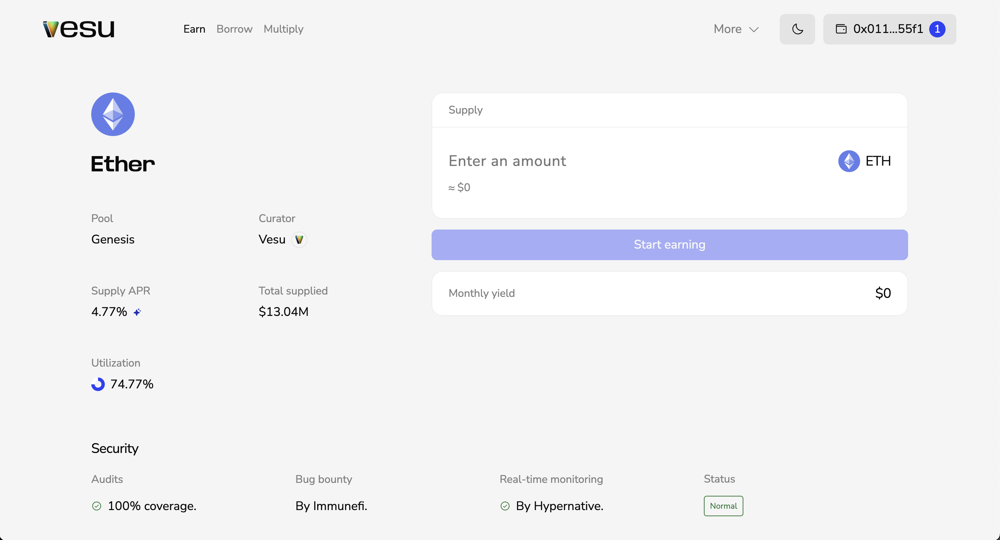

This guide walks you through opening and closing an Earn position.

### Opening a Position
Supply assets on Vesu to earn yield.

1. Go to [vesu.xyz/earn](https://vesu.xyz/earn) to see all available markets.  
   Use the filters to narrow by type, pool, curator, or other options. Click on the market you want to deposit into or learn more about.

 
 *note: no logo/navi in screenshot*

2. On the market page, you’ll find all key info:
   - **APR**: current supply rate 
   - **Utilization rate**: how much of supplied assets are borrowed
   - **Security and Oracles**: audits, bug bounty, monitoring, and price feeds  
   - **Collateral exposure**: assets your deposit can be borrowed against and their debt caps  
   - **Interest rate curve**: how rates change with utilization  
   - **Addresses**: contracts for pool, extension & asset

3. Enter the amount you want to supply. 
   The panel shows your estimated monthly yield.  

   [IMAGE: Enter amount]

4. Click **Start earning** and confirm the transaction in your wallet.  

   [IMAGE: Start earning]

Once confirmed, your position appears in the position overview and starts generating yield.

### Closing a Position
1. Go to your positions overview and select the position you want to close. 

   [IMAGE: Positions overview]

2. Click **Withdraw**, enter the amount and hit **Confirm**.

   [IMAGE: Close position]

3. Once confirmed, your assets return to your wallet.  

   [IMAGE: Assets returned]

