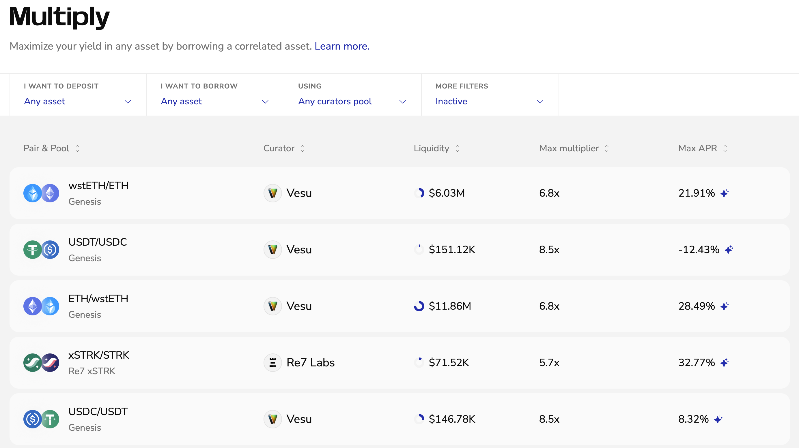

This guide walks you through opening and closing a Multiply position.

## Opening a Position
Use Multiply to increase your exposure and yield for a specific asset.

1. Go to [vesu.xyz/multiply](https://vesu.xyz/multiply) and pick a market. 
   Use the filters to choose your collateral/borrow pair. You can also show only tokens in your wallet, or filter by curator and pool.  

2. On the market page, check the key info for that pair:    
   Net APR, max multiplier, liquidity, liquidation price, and loan-to-value.  
[IMAGE: Market details]

3. Enter your **deposit** and choose the **Net APR**.   
   The borrow amount is calculated automatically from your multiplier. Make sure you’re comfortable with the shown monthly yield/cost, liquidation price, and LTV.  
[IMAGE: Enter deposit & multiplier]

4. Click **Multiply** and confirm in your wallet.  
   [IMAGE: Confirm]

Once confirmed, your position appears in your overview and starts accruing according to the displayed net APR.

## Closing a Position
To close a Multiply position:

1. Go to your positions overview and select the position you want to close.  
[IMAGE: Positions overview]

2. Click **Close Multiply** and confirm in your wallet.  
[IMAGE: Close position]

3. Once confirmed, the position unwinds and any remaining assets return to your wallet.  
[IMAGE: Assets returned]