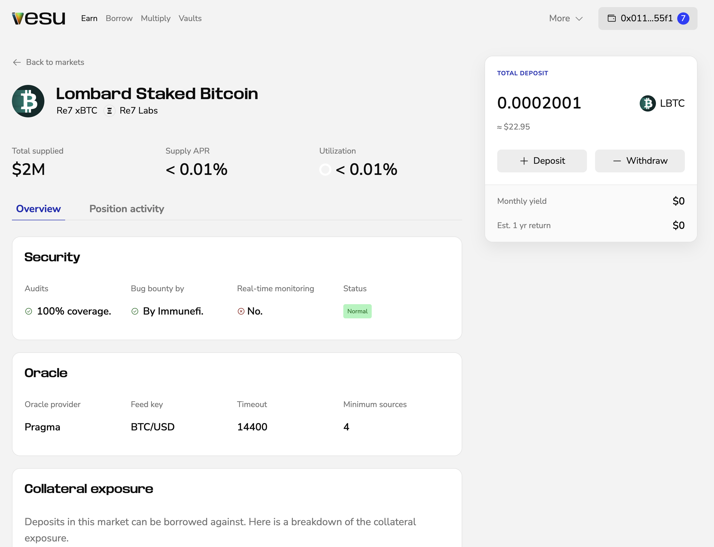

You can manage your positions anytime. Supply more, withdraw, borrow, or multiply.

Click the button showing your connected wallet in the top-right corner.
This opens the side navigation with your open positions. 

When you click on the position the market page opens, showing you all relevant informations. From here you can deposit more, withdraw partly or close your position.
