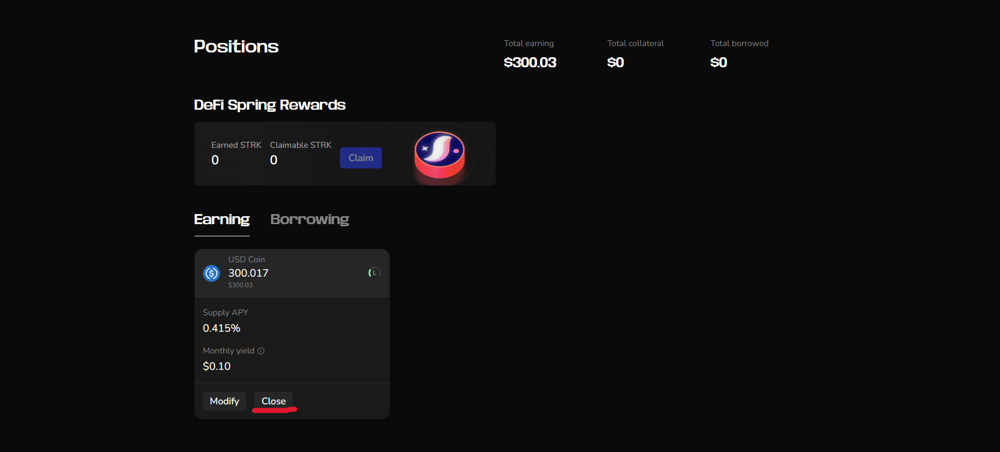
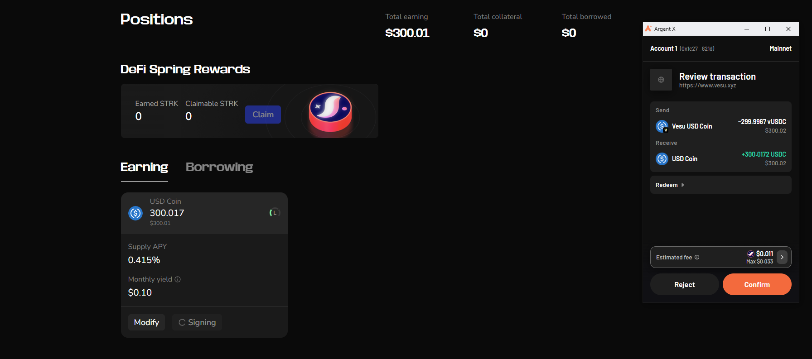
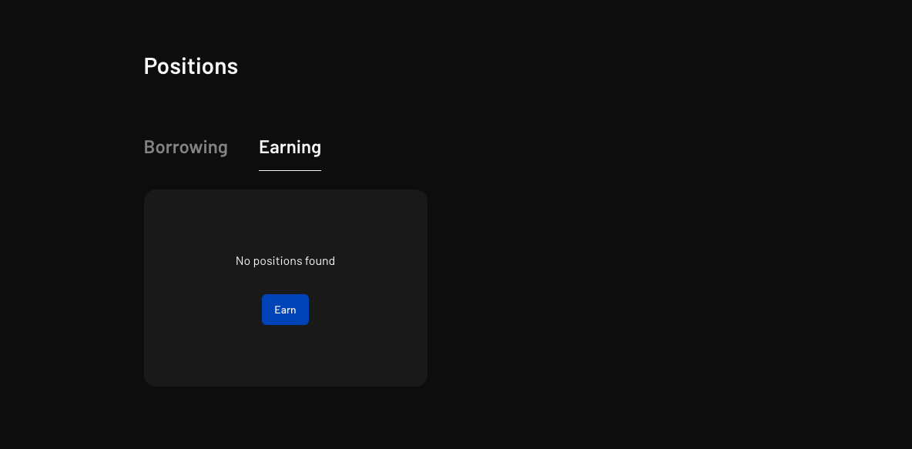

In this section of the user's guide, we are going to explore how to withdraw your assets from a market.

Make sure you are connected to the app before you proceed. See how [here](./connect.md).

1. To get started, ensure you already have a position created by supplying to the market. You can see how to do that [here](./supply.md).

2. To withdraw, head to the position whose assets you'll like to withdraw and click on the "Close" button.
   

3. Confirm your withdrawal transaction from your wallet provider.
   

4. Voila! your position has been withdrawn.
   
